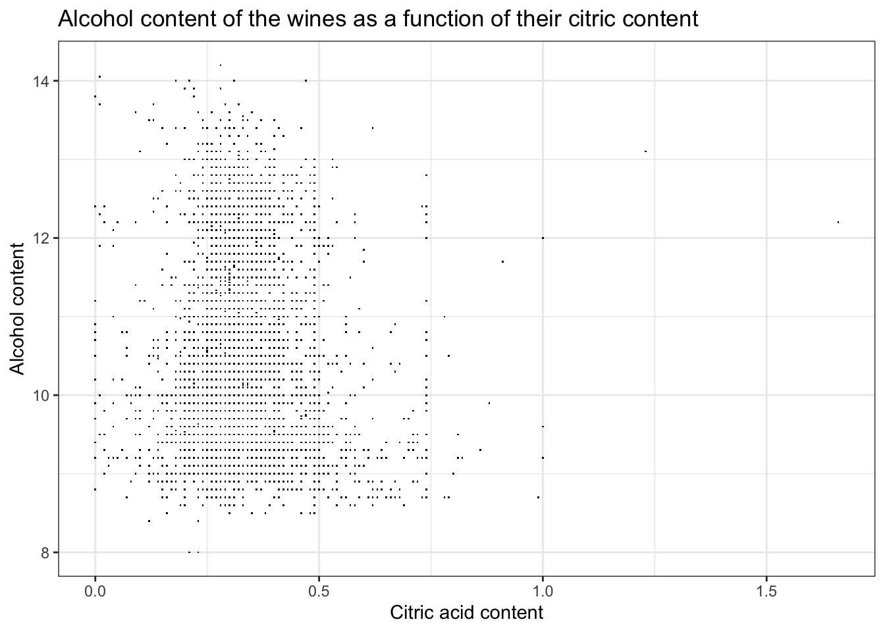

::: {.cell}

```{.r .cell-code}
here::i_am("Git Project Test.Rproj")
```

::: {.cell-output .cell-output-stderr}
```
here() starts at /Users/jeanbaptisteastruc/Desktop/QE/Data Management and Programming/Github/Git Project Test
```
:::

```{.r .cell-code}
library(here)
library(ggplot2)
library(hexbin)
theme_set(theme_bw())
```
:::


This is my Git Hub URL: [https://github.com/JBA15/Data-Management-R-Labs](https://github.com/JBA15/Data-Management-R-Labs)

# Exercise 1

First, let's import our data.


::: {.cell}

```{.r .cell-code}
whitewine <- readRDS(here("whitewine.Rds"))
```
:::


## Question 1


::: {.cell}

```{.r .cell-code}
ggplot(whitewine, aes(x = iquality)) +
  geom_bar() +
  ggtitle("Distribution of the quality of the wine") +
  xlab("Quality") +
  ylab("Number of wines")
```

::: {.cell-output-display}
{width=672}
:::
:::


## Question 2


::: {.cell}

```{.r .cell-code}
ggplot(whitewine, aes(x = fixed_acidity)) +
  geom_density(bw = "SJ") +
  geom_rug(alpha = 0.1, linewidth = 1.5) +
  geom_vline(xintercept = mean(whitewine$fixed_acidity), color = "darkred") +
  geom_vline(xintercept = median(whitewine$fixed_acidity), color = "darkblue") +
  ggtitle("Distribution of the fixed acidity of the wine") +
  xlab("Fixed acidity") +
  ylab("Number of wines")
```

::: {.cell-output-display}
{width=672}
:::
:::


## Question 3


::: {.cell}

```{.r .cell-code}
ggplot(whitewine, aes(x = citric_acid, y = alcohol)) +
  geom_point(shape = ".") +
  ggtitle("Alcohol content of the wines as a function of their citric content") +
  xlab("Citric acid content") +
  ylab("Alcohol content")
```

::: {.cell-output-display}
{width=672}
:::
:::


## Question 4


::: {.cell}

```{.r .cell-code}
ggplot(whitewine, aes(x = citric_acid, y = alcohol)) +
  geom_bin2d(bins = 35) +
  ggtitle("Alcohol content of the wines as a function of their citric content") +
  xlab("Citric acid content") +
  ylab("Alcohol content") +
  theme(legend.position = "bottom")
```

::: {.cell-output-display}
{width=672}
:::
:::


The graph obtained in the question 4 really helps us visualize that there is a majority a wines having a similar citric acid content.

## Question 5


::: {.cell}

```{.r .cell-code}
ggplot(whitewine, aes(x = citric_acid, y = alcohol)) +
  geom_bin2d(bins = 35) +
  scale_fill_viridis_c("Number of wines", option = "A") +
  ggtitle("Alcohol content of the wines as a function of their citric content") +
  xlab("Citric acid content") +
  ylab("Alcohol content") +
  theme(legend.position = "bottom")
```

::: {.cell-output-display}
{width=672}
:::
:::


The different colors help us in the differentiation process

## Question 6


::: {.cell}

```{.r .cell-code}
ggplot(whitewine, aes(x = pH, y = sulphates)) +
  geom_bin2d(bins = 35) +
  facet_wrap(~iquality) +
  scale_fill_viridis_c("Number of wines", option = "A") +
  ggtitle("Alcohol content of the wines as a function of their citric content, by quality") +
  xlab("PH") +
  ylab("Sulphates") +
  theme(legend.position = "bottom")
```

::: {.cell-output-display}
{width=672}
:::
:::

::: {.cell}

```{.r .cell-code}
ggplot(whitewine, aes(x = pH, y = sulphates)) +
  geom_bin_2d(bins = 35) +
  facet_grid(.~iquality) +
  scale_fill_viridis_c("Number of wines", option = "A") +
  ggtitle("Alcohol content of the wines as a function of their citric content, by quality") +
  xlab("PH") +
  ylab("Sulphates") +
  theme(legend.position = "None")
```

::: {.cell-output-display}
{width=672}
:::
:::


It seems that the second graph enables the reader to compare more easily the different wines by quality. Also, it allows the data to be more understandable and readable.

## Question 7


::: {.cell}

```{.r .cell-code}
ggplot(whitewine, aes(x = fquality, y = volatile_acidity)) +
  geom_point() +
  ggtitle("Wine volatile acidity in respect to quality") +
  xlab("Quality") +
  ylab("Volatile acidity")
```

::: {.cell-output-display}
{width=672}
:::
:::

::: {.cell}

```{.r .cell-code}
ggplot(whitewine, aes(x = fquality, y = volatile_acidity, color = fquality)) +
  geom_boxplot() +
  ggtitle("Wine volatile acidity in respect to quality") +
  xlab("Quality") +
  ylab("Volatile acidity")
```

::: {.cell-output-display}
{width=672}
:::
:::


The second representation is the best, as it shows important information (median, first and third quartiles, as well as extreme values/outliers) while being clearer than the first one.


# Exercise 2


::: {.cell}

```{.r .cell-code}
dropout <- readRDS(here("dropout.Rds"))
```
:::


## Question 1


::: {.cell}

```{.r .cell-code}
ggplot(dropout, aes(x = `Age at enrollment`)) +
  geom_bar() +
  geom_vline(xintercept = mean(dropout$`Age at enrollment`), color = "darkred") +
  geom_vline(xintercept = median(dropout$`Age at enrollment`), color = "darkblue") +
  ggtitle("Distribution of the age") +
  xlab("Age") +
  ylab("Number of people")
```

::: {.cell-output-display}
{width=672}
:::
:::


## Question 2


::: {.cell}

```{.r .cell-code}
ggplot(dropout, aes(x = `Age at enrollment`)) +
  geom_bar() +
  facet_wrap(~Gender) +
  geom_vline(xintercept = mean(dropout$`Age at enrollment`), color = "darkred") +
  geom_vline(xintercept = median(dropout$`Age at enrollment`), color = "darkblue") +
  ggtitle("Distribution of the age conditionned on the gender") +
  xlab("Age") +
  ylab("Number of people")
```

::: {.cell-output-display}
{width=672}
:::
:::


## Question 3


::: {.cell}

```{.r .cell-code}
ggplot(dropout, aes(x = `Scholarship holder`, fill = Target)) +
  geom_bar(position = "dodge") +
  ggtitle("Scholarship holder and Target") +
  xlab("Scholarship holder") +
  ylab("Number of people") +
  theme(legend.position = "bottom")
```

::: {.cell-output-display}
{width=672}
:::
:::


We can see that a vast majority of the scholarship holders graduated.

## Question 4


::: {.cell}

```{.r .cell-code}
ggplot(dropout, aes(x = `Age at enrollment`, fill = Target)) +
  geom_bar(position = "dodge") +
  facet_grid(Gender~`Scholarship holder`) +
  ggtitle("Scholarship holder and Target, conditioned on the gender") +
  xlab("Scholarship holder") +
  ylab("Number of people") +
  theme(legend.position = "bottom")
```

::: {.cell-output-display}
{width=672}
:::
:::

::: {.cell}

```{.r .cell-code}
ggplot(dropout, aes(x = `Age at enrollment`, fill = Target)) +
  geom_bar() +
  facet_grid(Gender~`Scholarship holder`) +
  ggtitle("Scholarship holder and Target, conditioned on the gender") +
  xlab("Scholarship holder") +
  ylab("Number of people") +
  theme(legend.position = "bottom")
```

::: {.cell-output-display}
{width=672}
:::
:::


Sometimes, less is more, or at least more understandable.

## Question 5


::: {.cell}

```{.r .cell-code}
ggplot(dropout, aes(x = `Curricular units 1st sem (grade)`, y = `Curricular units 2nd sem (grade)`)) +
  geom_point() +
  geom_smooth(method = "lm", color = "darkred") +
  ggtitle("First and second semester grades") +
  xlab("First semester grade") +
  ylab("Second semester grade")
```

::: {.cell-output .cell-output-stderr}
```
`geom_smooth()` using formula = 'y ~ x'
```
:::

::: {.cell-output-display}
{width=672}
:::
:::


## Question 6


::: {.cell}

```{.r .cell-code}
ggplot(dropout, aes(x = `Curricular units 1st sem (grade)`, y = `Curricular units 2nd sem (grade)`, color = Target)) +
  geom_jitter(alpha = 0.5) +
  geom_smooth(method = "lm", color = "black") +
  ggtitle("First and second semester grades, Target being color seperated") +
  xlab("First semester grade") +
  ylab("Second semester grade")
```

::: {.cell-output .cell-output-stderr}
```
`geom_smooth()` using formula = 'y ~ x'
```
:::

::: {.cell-output-display}
{width=672}
:::
:::

::: {.cell}

```{.r .cell-code}
ggplot(dropout, aes(x = `Curricular units 1st sem (grade)`, y = `Curricular units 2nd sem (grade)`)) +
  geom_point(shape = ".") +
  facet_wrap(~Target) +
  geom_smooth(method = "lm", color = "darkred") +
  ggtitle("First and second semester grades, by Target") +
  xlab("First semester grade") +
  ylab("Second semester grade")
```

::: {.cell-output .cell-output-stderr}
```
`geom_smooth()` using formula = 'y ~ x'
```
:::

::: {.cell-output-display}
{width=672}
:::
:::

The second graph is way more understandable. Having three separate graphs helps us understanding how the population of graduates is higher, and how dropouts tend to have a 0 during their first semester.

## Question 7


::: {.cell}

```{.r .cell-code}
ggplot(dropout, aes(x = Target, fill = `Marital status`)) +
  geom_bar(position = "dodge") +
  ggtitle("Target and marital status") +
  xlab("Target") +
  ylab("Number of people") +
  theme(legend.position = "bottom")
```

::: {.cell-output-display}
{width=672}
:::
:::


## Question 8


::: {.cell}

```{.r .cell-code}
ggplot(dropout, aes(x = Target, fill = `Marital status`)) +
  geom_bar(position = "dodge") +
  facet_wrap(~`Scholarship holder`) +
  ggtitle("Target and marital status, by Scholarship holder being true or false") +
  xlab("Target") +
  ylab("Number of people") +
  theme(legend.position = "bottom")
```

::: {.cell-output-display}
{width=672}
:::
:::
